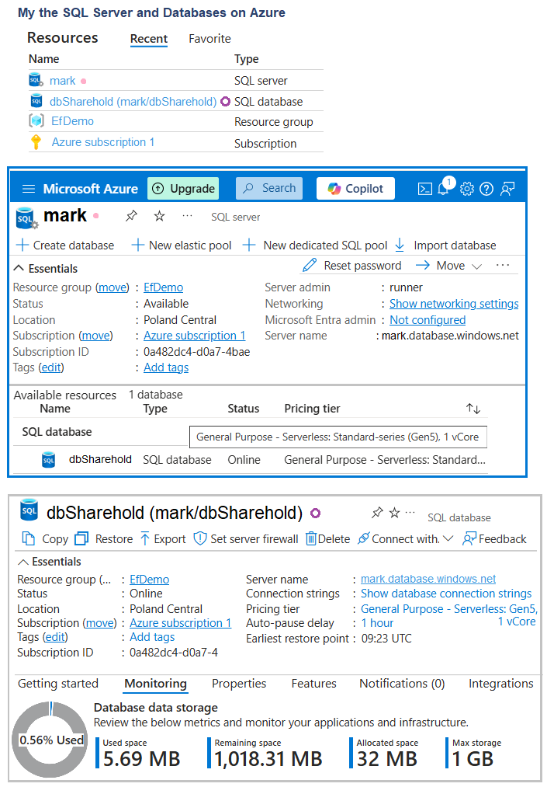

#  Azure SQL Database

Azure provides several models for deploying SQL databases, tailored for different needs and workloads. These options fall into two primary categories: Platform as a Service (PaaS) and Infrastructure as a Service (IaaS).

## 🔷 Azure SQL Deployment Models

### 🔶 Azure SQL Database (PaaS)
A fully managed platform for relational and non-relational databases. Microsoft handles maintenance, backups, and high availability.

- **☑ Single Database**
  - A fully managed, isolated database.
  - Best for applications requiring their own database.

- **☑ Elastic Pool**
  - A collection of single databases that share resources.
  - Ideal for multiple databases with varying and unpredictable usage.

### 🔶 Azure SQL Managed Instance (PaaS)
- Combines features of single databases and elastic pools.
- Offers near-complete SQL Server compatibility.
- Native integration with Azure Virtual Network (VNet).
- Suitable for easy migration from on-premises SQL Server.

### 🔶 SQL Server on Azure VM (IaaS)
- Customer fully manages their own SQL Server installation on a virtual machine.
- Offers full control over SQL Server and OS-level configurations.
- Useful for legacy applications or highly customized environments.

---

## 💰 SQL Database Purchasing Models
Azure SQL supports two pricing models: **vCore-based** and **DTU-based**.

### 📌 Virtual Core (vCore) Model
Reflects the physical hardware configuration:

- **☑ Broad Configuration Options:**
  - Number of cores
  - Amount of memory
  - Amount and speed of storage
  - Hybrid and flexible combinations of SQL server configurations

- **☑ Service Tiers:**
  - **General Purpose**: For typical workloads.
  - **Business Critical**: Optimized for OLTP applications, frequent transactions, and low I/O latency.
  - **Hyperscale**: High flexibility and performance. Scalable storage, isolated database replicas, and resilience.

- **☑ Compute Tiers:**
  - **Provisioned**: Pre-allocated computing resources. Billed hourly.
  - **Serverless**: Auto-scaled resources. Billed per second. Includes auto-pause for cost savings.

### 📌 DTU-Based Model (Database Transaction Unit)
Fixed price/performance options combining CPU, memory, and I/O:

- **☑ Service Tiers:**
  - **Basic**: For small, lightweight applications.
  - **Standard**: Suitable for most business workloads.
  - **Premium**: High-performance for OLTP and mission-critical apps.

## 🔷 My Azure SQL Server and Databases

I created on Azure:  SQL Server and Databases:

